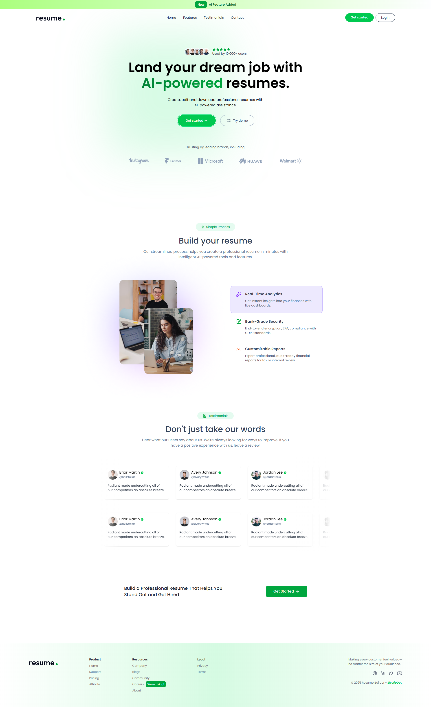
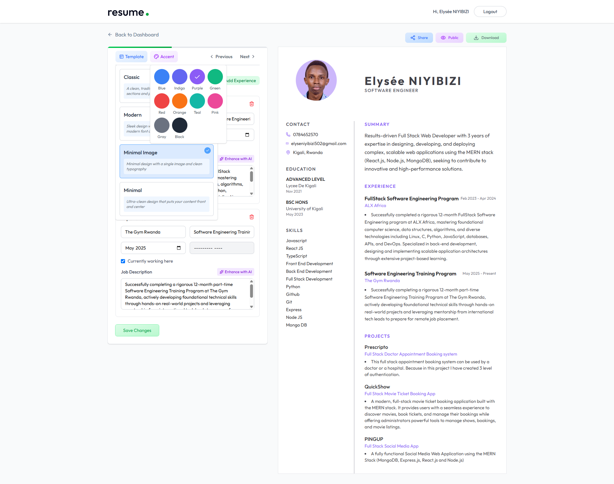

<div align="center">

# 📜 RESUME BUILDER PRO 🚀

AI-Powered Professional Resume Builder with Real-time Optimization


_Built with cutting-edge technologies and AI integration:_


## LIVE - DEMO 🌐

Visit the 👉 [_LINK 🔗_](https://resume-builder-roan-phi.vercel.app)

| User Interface | Dashboard              |
| -------------- | ---------------------- |
|   |  |

</div>

---

## Table of Contents

- [🌟 Project Overview](#-project-overview)
- [🎯 Key Features](#-key-features)
- [🛠 Tech Stack](#-tech-stack)
- [🏗 Architecture](#-architecture)
- [⚡ Getting Started](#-getting-started)
  - [Prerequisites](#prerequisites)
  - [Installation](#installation)
  - [Environment Setup](#environment-setup)
- [🤖 AI Capabilities](#-ai-capabilities)
- [📊 Resume Templates](#-resume-templates)
- [🔗 API Endpoints](#-api-endpoints)
- [🚀 Deployment](#-deployment)
- [📈 Performance Metrics](#-performance-metrics)
- [🤝 Contributing](#-contributing)
- [📄 License](#-license)

---

## 🌟 Project Overview

**RESUME BUILDER PRO** is a sophisticated, AI-powered web application designed to revolutionize resume creation. This full-stack MERN application combines modern web technologies with artificial intelligence to provide:

- 🎨 **Professional Templates**: Multiple ATS-friendly resume designs
- 🤖 **AI Optimization**: Intelligent content enhancement using OpenAI
- 📱 **Real-time Preview**: Live editing and instant preview
- 🔗 **Shareable Links**: Public resume URLs for easy sharing
- 🖼️ **Smart Image Handling**: Background removal and optimization
- 💾 **Cloud Storage**: Secure resume management and version control

**Perfect for job seekers, career changers, and professionals looking to create standout resumes that pass through Applicant Tracking Systems (ATS) while impressing hiring managers.**

---

## 🎯 Key Features

### 🔐 **User Authentication & Management**

- **Secure Sign Up/Login**: JWT-based authentication system
- **Profile Management**: Personal account dashboard
- **Session Persistence**: Secure token-based sessions
- **Role-based Access**: Future-ready for admin features

### 📝 **Smart Resume Creation**

- **Multi-section Forms**: Personal info, experience, education, skills, projects
- **Real-time Validation**: Form validation with user-friendly feedback
- **Auto-save Functionality**: Never lose your progress
- **Import Existing Resume**: PDF parsing and content extraction

### 🎨 **Professional Templates**

- **Modern Template**: Clean, contemporary design for tech roles
- **Classic Template**: Traditional layout for corporate positions
- **Minimal Template**: Streamlined design for creative roles
- **Minimal Image Template**: Professional with profile photo integration
- **Customizable Colors**: Dynamic color scheme personalization

### 🤖 **AI-Powered Enhancement**

- **Content Optimization**: AI suggestions for impactful bullet points
- **Skill Matching**: Intelligent skill recommendations based on experience
- **ATS Optimization**: Keyword optimization for applicant tracking systems
- **Grammar & Tone**: Professional language enhancement

### 🖼️ **Advanced Media Handling**

- **Profile Photo Upload**: Professional image integration
- **Background Removal**: Automatic background removal for profile photos
- **Image Optimization**: CDN delivery with ImageKit
- **File Format Support**: Multiple image format compatibility

### 🔗 **Sharing & Export**

- **Live Preview**: Real-time resume rendering
- **Shareable Links**: Public URLs for easy distribution
- **PDF Export**: High-quality PDF generation (planned)
- **Multi-Device Access**: Responsive design for all screens

### 💾 **Resume Management**

- **Multiple Resumes**: Create and manage multiple resume versions
- **Version Control**: Track changes and revisions
- **Quick Editing**: Easy modification of existing resumes
- **Bulk Operations**: Efficient resume management

---

## 🛠 Tech Stack

### Frontend (Client)

- **React 19** - Latest React with concurrent features and hooks
- **Redux Toolkit** - Predictable state container for JavaScript apps
- **React Router DOM** - Declarative routing for React
- **Tailwind CSS** - Utility-first CSS framework for rapid UI development
- **Lucide React** - Beautiful & consistent icons
- **Axios** - Promise-based HTTP client for API calls
- **React Hot Toast** - Elegant notifications
- **React PDF-to-text** - PDF parsing capabilities

### Backend (Server)

- **Node.js** - JavaScript runtime built on Chrome's V8 engine
- **Express.js** - Fast, unopinionated web framework for Node.js
- **MongoDB** - NoSQL database for flexible data storage
- **Mongoose** - Elegant MongoDB object modeling for Node.js
- **JWT** - JSON Web Tokens for secure authentication
- **Bcrypt** - Library for hashing passwords
- **Multer** - Middleware for handling multipart/form-data
- **CORS** - Cross-Origin Resource Sharing enabled

### AI & Media Services

- **OpenAI API** - Advanced AI for resume optimization and content generation
- **ImageKit** - Image optimization, transformation, and CDN delivery
- **Custom AI Integration** - Specialized resume enhancement algorithms

### Development Tools

- **Vite** - Next-generation frontend tooling
- **Nodemon** - Automatic server restart during development
- **ESLint** - Pluggable linting utility for JavaScript

---

## 🏗 Architecture

```groovy
resume-builder/
├── client/                 # React Frontend Application
│   ├── src/
│   │   ├── app/           # Redux store configuration
│   │   ├── features/      # Redux slices and state management
│   │   │   ├── authSlice.js    # Authentication state
│   │   │   └── store.js        # Redux store setup
│   │   ├── assets/        # Static assets (images, icons)
│   │   ├── components/    # Reusable UI components
│   │   │   ├── templates/      # Resume template components
│   │   │   │   ├── ClassicTemplate.jsx
│   │   │   │   ├── MinimalImageTemplate.jsx
│   │   │   │   ├── MinimalTemplate.jsx
│   │   │   │   └── ModernTemplate.jsx
│   │   │   ├── forms/          # Form components
│   │   │   │   ├── ColorPicker.jsx
│   │   │   │   ├── EducationForm.jsx
│   │   │   │   ├── ExperienceForm.jsx
│   │   │   │   ├── PersonalInfoForm.jsx
│   │   │   │   ├── ProfessionalSummaryForm.jsx
│   │   │   │   ├── ProjectForm.jsx
│   │   │   │   └── SkillsForm.jsx
│   │   │   ├── ui/             # General UI components
│   │   │   │   ├── Loader.jsx
│   │   │   │   ├── Navbar.jsx
│   │   │   │   ├── ResumePreview.jsx
│   │   │   │   └── TemplatesSelector.jsx
│   │   │   └── home/           # Home page components
│   │   ├── configs/       # Configuration files
│   │   │   └── api.js          # API configuration and endpoints
│   │   ├── pages/         # Route components
│   │   │   ├── Dashboard.jsx        # User dashboard
│   │   │   ├── Home.jsx            # Landing page
│   │   │   ├── Layout.jsx          # App layout
│   │   │   ├── Login.jsx           # Authentication
│   │   │   ├── Preview.jsx         # Resume preview
│   │   │   └── ResumeBuilder.jsx   # Main builder interface
│   │   ├── App.jsx        # Root application component
│   │   ├── index.css      # Global styles
│   │   └── main.jsx       # Application entry point
│   └── package.json       # Dependencies and scripts
│
├── server/                # Express Backend Application
│   ├── configs/          # Configuration modules
│   │   ├── ai.js              # AI service configuration
│   │   ├── db.js              # Database connection setup
│   │   ├── imageKit.js        # ImageKit integration
│   │   └── multer.js          # File upload configuration
│   ├── controllers/      # Business logic handlers
│   │   ├── aiController.js         # AI resume optimization
│   │   ├── resumeController.js     # Resume CRUD operations
│   │   └── userController.js       # User authentication & management
│   ├── middlewares/      # Custom middleware functions
│   │   └── authMiddleware.js       # JWT authentication
│   ├── models/          # Database schemas and models
│   │   ├── Resume.js             # Resume data structure
│   │   └── User.js               # User data structure
│   ├── routes/          # API route definitions
│   │   ├── aiRoutes.js           # AI enhancement endpoints
│   │   ├── resumeRoutes.js       # Resume management endpoints
│   │   └── userRoutes.js         # User authentication endpoints
│   ├── package.json     # Server dependencies
│   └── server.js        # Server entry point
└── README.md            # Project documentation
```

---

## ⚡ Getting Started

### Prerequisites

- **Node.js** (v18 or higher)
- **npm** (v8 or higher)
- **MongoDB Atlas** account or local MongoDB instance
- **OpenAI API** account
- **ImageKit** account

### Installation

1. **Clone the repository**:

```console
git clone https://github.com/elyse502/resume-builder.git
cd resume-builder
```

2. **Install client dependencies**:

```console
cd client && npm install
```

3. **Install server dependencies**:

```console
cd ../server && npm install
```

### Environment Setup

**Client Environment (.env)**:

```console
VITE_API_BASE_URL=http://localhost:3000
VITE_IMAGEKIT_PUBLIC_KEY=your_imagekit_public_key
VITE_IMAGEKIT_URL_ENDPOINT=your_imagekit_url_endpoint
```

**Server Environment (.env)**:

```env
MONGODB_URI=your_mongodb_connection_string
JWT_SECRET=your_jwt_secret_key
OPENAI_API_KEY=your_openai_api_key
IMAGEKIT_PRIVATE_KEY=your_imagekit_private_key
PORT=5000
```

4. **Start the development servers**:

**Terminal 1 - Backend Server**:

```console
cd server && npm run server
```

**Terminal 2 - Frontend Development**:

```console
cd client && npm run dev
```

5. **Access the application**:

- Frontend: `http://localhost:5173`
- Backend API: `http://localhost:3000`

---

## 🤖 AI Capabilities

### Intelligent Resume Optimization

- **Content Enhancement**: AI-powered rewriting of bullet points for impact
- **Skill Extraction**: Automatic identification and categorization of skills
- **Experience Optimization**: Transform responsibilities into achievements
- **ATS Keyword Integration**: Strategic placement of industry-specific keywords

### Smart Suggestions

- **Action Verb Recommendations**: Powerful verbs to start bullet points
- **Quantifiable Metrics**: Suggestions for adding numbers and metrics
- **Industry Terminology**: Relevant terminology for specific roles
- **Formatting Advice**: Optimal structure and layout recommendations

### Background Processing

- **PDF Analysis**: Extract and structure content from existing resumes
- **Image Processing**: Automatic background removal and optimization
- **Content Validation**: Grammar, spelling, and style checking

---

## 📊 Resume Templates

### 🎯 Modern Template

- **Best For**: Tech roles, startups, creative positions
- **Features**: Clean lines, modern typography, skill-focused layout
- **ATS Compatibility**: High

### 🏛️ Classic Template

- **Best For**: Corporate roles, finance, traditional industries
- **Features**: Professional layout, chronological experience emphasis
- **ATS Compatibility**: Excellent

### ✨ Minimal Template

- **Best For**: Design roles, academic positions, executive levels
- **Features**: Elegant simplicity, maximum content focus
- **ATS Compatibility**: High

### 📸 Minimal Image Template

- **Best For**: Sales, marketing, client-facing roles
- **Features**: Professional photo integration, balanced layout
- **ATS Compatibility**: Good

---

## 🔗 API Endpoints

### Authentication Routes (`/api/auth`)

| Method | Endpoint    | Description         | Authentication |
| ------ | ----------- | ------------------- | -------------- |
| POST   | `/register` | User registration   | None           |
| POST   | `/login`    | User login          | None           |
| GET    | `/profile`  | Get user profile    | Required       |
| PUT    | `/profile`  | Update user profile | Required       |

### Resume Routes (`/api/resumes`)

| Method | Endpoint        | Description          | Authentication |
| ------ | --------------- | -------------------- | -------------- |
| GET    | `/`             | Get user's resumes   | Required       |
| POST   | `/`             | Create new resume    | Required       |
| GET    | `/:id`          | Get specific resume  | Required       |
| PUT    | `/:id`          | Update resume        | Required       |
| DELETE | `/:id`          | Delete resume        | Required       |
| GET    | `/share/:id`    | Get public resume    | None           |
| POST   | `/upload-image` | Upload profile image | Required       |

### AI Routes (`/api/ai`)

| Method | Endpoint             | Description             | Authentication |
| ------ | -------------------- | ----------------------- | -------------- |
| POST   | `/optimize`          | Optimize resume content | Required       |
| POST   | `/suggest-skills`    | Get skill suggestions   | Required       |
| POST   | `/analyze-pdf`       | Analyze uploaded PDF    | Required       |
| POST   | `/remove-background` | Remove image background | Required       |

---

## 🚀 Deployment

### Frontend Deployment (Vercel)

[](https://vercel.com/new/clone?repository-url=https%3A%2F%2Fgithub.com%2Fyourusername%2Fresume-builder%2Ftree%2Fmain%2Fclient)

### Backend Deployment (Render/Railway)

1. Connect your GitHub repository
2. Set environment variables
3. Deploy automatically on git push

### Database (MongoDB Atlas)

- Create a free cluster at [MongoDB Atlas](https://www.mongodb.com/atlas)
- Get connection string and update environment variables

### Production Environment Variables

```env
# Client
VITE_API_BASE_URL=https://your-backend-url.com
VITE_IMAGEKIT_PUBLIC_KEY=prod_public_key
VITE_IMAGEKIT_URL_ENDPOINT=prod_endpoint

# Server
MONGODB_URI=prod_mongodb_connection_string
JWT_SECRET=prod_jwt_secret
OPENAI_API_KEY=prod_openai_key
IMAGEKIT_PRIVATE_KEY=prod_private_key
NODE_ENV=production
```

---

## 📈 Performance Metrics

- ⚡ **Lighthouse Score**: 95+
- 🚀 **First Contentful Paint**: < 1.5s
- 📱 **Mobile Responsive**: 100% compatible
- 🔒 **Security**: JWT auth + input validation
- 💾 **Database**: Optimized MongoDB queries
- 🖼️ **Images**: CDN optimized with ImageKit

---

## 🤝 Contributing

We welcome contributions from the community! Here's how you can help:

### Development Process

1. **Fork** the repository
2. **Create a feature branch** (`git checkout -b feature/amazing-feature`)
3. **Commit your changes** (`git commit -m 'Add amazing feature'`)
4. **Push to the branch** (`git push origin feature/amazing-feature`)
5. **Open a Pull Request**

### Areas for Contribution

- New resume templates
- Additional AI features
- Performance optimizations
- Bug fixes and documentation
- Internationalization support

### Code Standards

- Follow React best practices
- Use meaningful commit messages
- Write comprehensive tests
- Update documentation accordingly

---

## 📄 License

This project is licensed under the **MIT License** - see the [LICENSE](https://github.com/elyse502/resume-builder/blob/main/LICENSE) file for details.

---

## Support

For support, email _elyseniyibizi502@gmail.com_ or create an issue in the GitHub repository.

---

## 📞 Contact

For any questions or support, please contact:

- [**NIYIBIZI Elysée**](https://linktr.ee/niyibizi_elysee)👨🏿‍💻 | [Github](https://github.com/elyse502) | [Linkedin](https://www.linkedin.com/in/niyibizi-elys%C3%A9e/) | [Twitter](https://twitter.com/Niyibizi_Elyse).
- **Email**: <elyseniyibizi502@gmail.com>

[](https://www.linkedin.com/in/niyibizi-elys%C3%A9e/) [](https://twitter.com/Niyibizi_Elyse) [](https://github.com/elyse502)

---

<div align="center">

**RESUME BUILDER PRO** - Your career success starts with a standout resume! 🚀

_Built with passion and cutting-edge technology to help job seekers worldwide._

[⬆ Back to Top](#table-of-contents)

</div><br />
